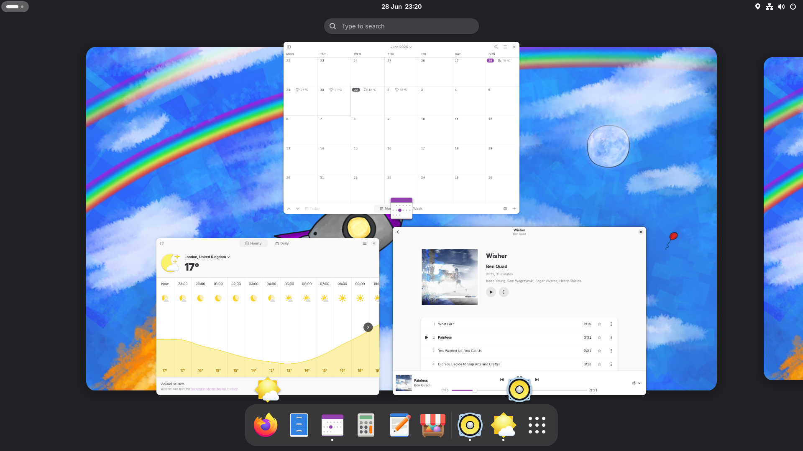

# Apollo
<picture>
    <source srcset="docs/landing-screenshot-dark.png" media="(prefers-color-scheme: dark)">
    
</picture>

Apollo is an up to date, easy to use and privacy respecting operating system for your computer, based on Arch Linux and bootc. Apollo is designed to serve a wide-variety of use cases, including everyday use, containerised development and gaming.

## Current status
Apollo is still experimental and should be considered to be in a **pre-alpha** state. Use with caution; stability is not guaranteed at this time and basic things *will* be missing. You should be fully prepared to report bugs and in general, help is appreciated.

## Installing
WIP, ISOs are being worked on.

## Contributing
Please read our [CONTRIBUTING.md file](CONTRIBUTING.md) for information around contributing to Apollo.

## Credits
- [bootcrew](https://github.com/bootcrew/) for providing an arch-bootc based image.
- Arch Linux for providing a package base for Apollo.
- Universal Blue for many important parts of the project, such as their homebrew image
